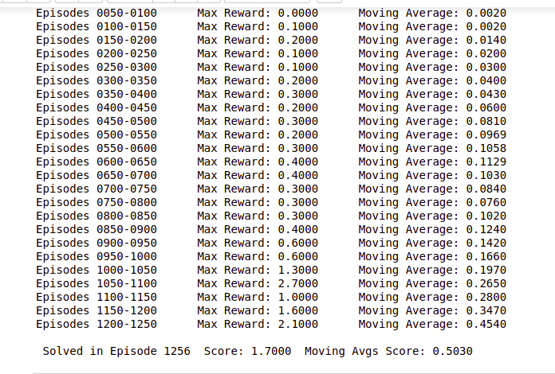
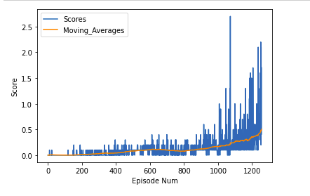

# Udacity Deep Reinforcement Learning Nanodegree Project 3: Collaboration and Competition

## Introduction

This project is part of the [Deep Reinforcement Learning Nanodegree Program](https://www.udacity.com/course/deep-reinforcement-learning-nanodegree--nd893), by Udacity.

## Project's goal

For this project, Training two robot players control rackets to bounce a ball over a net as many times as possible. If an player hits the ball over the net, it receives a reward of +0.1. If an agent lets a ball hit the ground or hits the ball out of bounds, it receives a reward of -0.01. Thus, the goal of each agent is to keep the ball in play.

The observation space consists of 8 variables corresponding to the position and velocity of the ball and racket. Each agent receives its own, local observation. Two continuous actions are available, corresponding to movement toward (or away from) the net, and jumping.

The task is episodic, and in order to solve the environment, your agents must get an average score of +0.5 (over 100 consecutive episodes, after taking the maximum over both agents). Specifically,

After each episode, we add up the rewards that each agent received (without discounting), to get a score for each agent. This yields 2 (potentially different) scores. We then take the maximum of these 2 scores. This yields a single score for each episode. The environment is considered solved, when the average (over 100 episodes) of those scores is at least **+0.5**.

## Development

This project uses an *off-policy method* called **Multi Agent Deep Deterministic Policy Gradient (MADDPG)** algorithm. MADDPG find its origins in an *off-policy method* called **Deep Deterministic Policy Gradient (DDPG)** and described in the paper [Continuous control with deep reinforcement learning](https://arxiv.org/abs/1509.02971). 

## Network architecture

### Architecture of Actor Network

- 2 hidden layers and one output layer
- One hidden layer has 256 hidden units and other one with 512 hidden units, both of them followed by a `ReLU` activation layer
- Output layer is followed by a tanh activation layer

### Architecture of Critic Network**

- 2 hidden layers and one output layer
- One hidden layer has 256 hidden units and other one with 512 hidden units, both of them followed by a `ReLU` activation layer
- Output layer is followed by a linear activation unit

### Hyperparameters

* BUFFER_SIZE = 1e6  # replay buffer size
* BATCH_SIZE = 512        # minibatch size
* GAMMA = 0.99            # discount factor
* TAU = 1e-3              # for soft update of target parameters
* LR_ACTOR = 1e-4         # learning rate of the actor
* LR_CRITIC = 1e-4        # learning rate of the critic
* WEIGHT_DECAY = 0.0001       # L2 weight decay
* n_episodes=2000         # maximum number of episodes to train

## Plot of Rewards

**The objective to get an average score (over 100 episodes) at least +0.5 achieved as shown in the image. It took 1256 episodes to achieve the outcome.**

## Ideas for Future Work

* Improved hyperparameter tuning can provide improved results.
* Implementing different network architectures for actor and critic networks.
* Understanding if same agents can be trained simultaneously using multiple games.
* Batch normalisation can be introduced.
